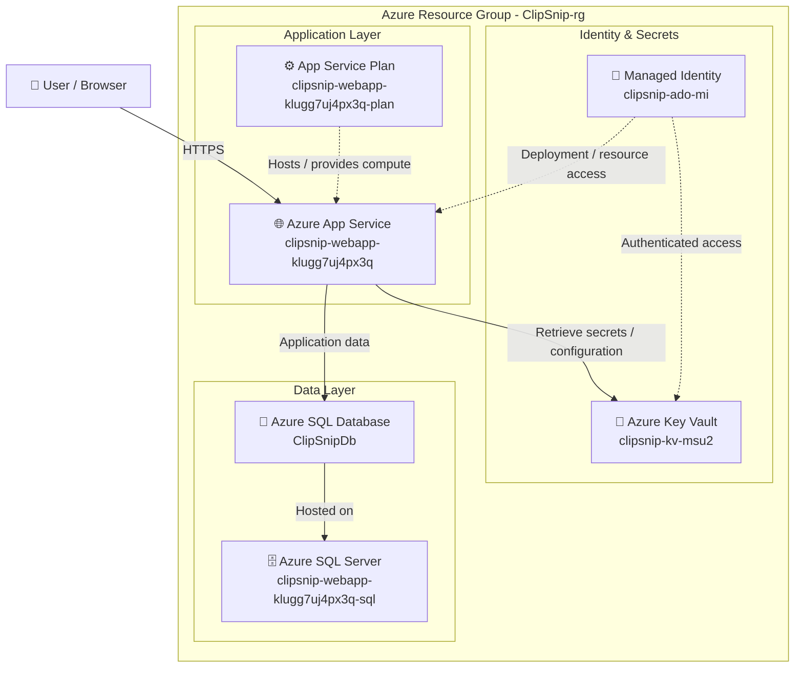

# ClipSnip

ClipSnip is an ASP.NET Core MVC application hosted in Microsoft Azure.

The application uses Azure App Service for hosting, Azure SQL Database for persistent storage, Azure Key Vault for secrets, and Azure Managed Identity for secure access to Azure resources.

---

## Architecture

The production environment is hosted in Azure and consists of an application layer, security layer, and data layer.

### Azure Resources

| Resource | Purpose |
|---|---|
| **Azure App Service** | Hosts the ASP.NET Core MVC application |
| **App Service Plan** | Provides compute resources for the App Service |
| **Azure SQL Server** | Logical SQL server hosting the application database |
| **ClipSnipDb** | Main production database |
| **Azure Key Vault** | Stores sensitive configuration and secrets |
| **Managed Identity** | Provides identity-based authentication to Azure resources |

---

## Technology Stack

- ASP.NET Core MVC
- .NET 10
- Entity Framework Core
- ASP.NET Core Identity
- Azure App Service
- Azure SQL Database
- Azure Key Vault
- Azure Managed Identity
- Azure DevOps
- Bicep
- Google MediaPipe
